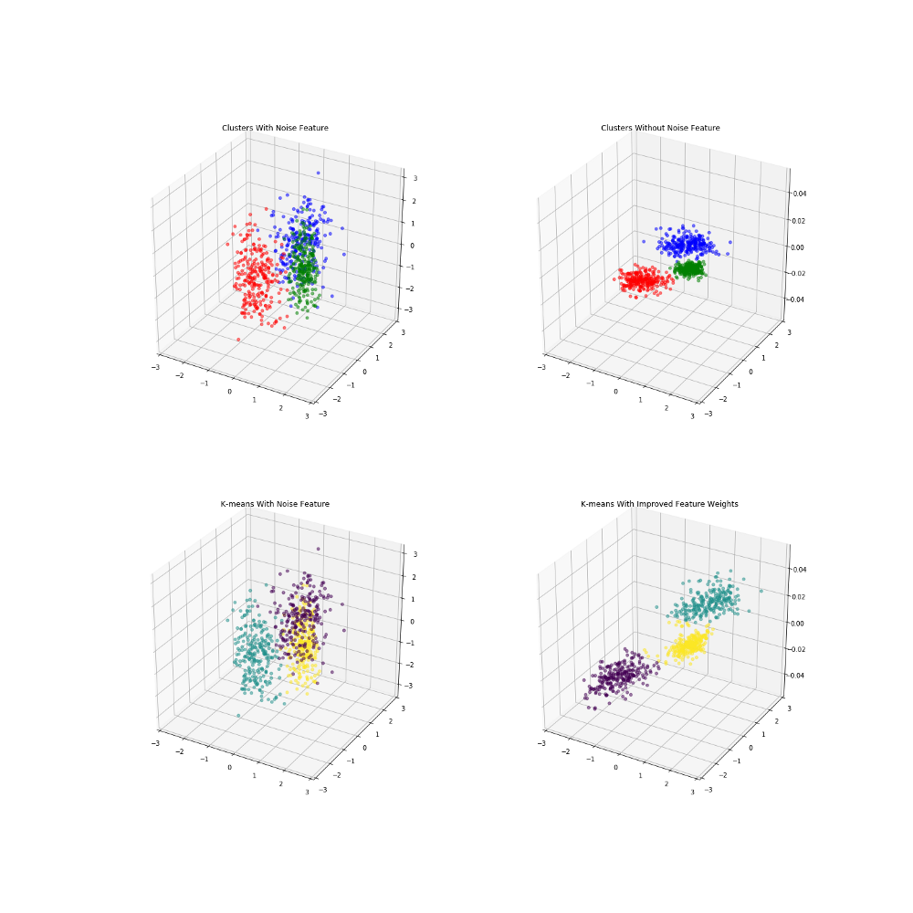

# Feature Weighted Fuzzy C-Means Classifier

When trying to cluster data into separate groups, it is often difficult to understand what features to include as well as how much importance to give to each. In this case, feature weight assignment can be seen as a generalization of feature selection. The purpose of this library is to take a data set and determine feature weights for each feature ranging from [0,1]. The results of the feature weight learning will be tested on a weighted fuzzy c-means on the Iris data set from the UCI machine learning repository.

## Algorithm

The guiding principle of similarity based clustering is that similar objects are within the same cluster and dissimilar objects are in different clusters. This is not different than the goal of most conventional clustering algorithms. With similarity based clustering, a measure must be given to determine how similar two objects are. This similarity measure is based off distance, and different distance metrics can be employed, but the similarity measure results in a value in [0,1] with 0 having no similarity and 1 being identical. To measure feature weight importance, we will have to use a weighted euclidean distance function. The similarity measure is defined in the following:


β here is a value that we will actually have to solve for, (w) represents the distance weight matrix, and d represents the pairwise distances between all objects. To solve for β, we have to use the assumption that if using the standard weights(all 1's), our similarity matrix would uniformly distributed between [0,1] resulting in a mean of .5. So to find β, we solve the equation:


If using a weighted euclidean distance, it is possible to use this similarity matrix to identify what features introduce more noise and which ones are important to clustering. The ultimate goal is to minimize the "fuzziness" of the similarity matrix, trying to move everything in the middle (ie .5) to either 1 or 0. For this purpose we use the loss metric:


Here (1) represents the base weights (all 1's). ρ represents the resulting fuzzy partition matrix that is a product of the weights used in the euclidean distance function between points p and q. 
We can then attempt to use Gradient Descent on this loss function to try and minimize it with respect to the similarity matrix. Gradient Descent is one of the most common optimization algorithms in machine learning that is used to find best parameters of a given function by using the function gradient, a combination of the partial derivatives. By taking steps proportional to the negative of the gradient, we can try to find the local minimum of the function. We will continually update the weights until either our maximum number of iterations has been met, or the function converges. So the gradient descent will be of our loss function with a partial derivative in respect to the weights. 
Where n is the learning rate defined. n is a very important parameter, as something too small will require too much computation, while too big and the function may never converge. 
If you can think of it in terms of a 3D graph, it would be like stretching or shrinking each axis, in a way that would put our points into tighter groups, that are further away from each other. We are not actually changing the locations of the data, we are solely transforming how we measure the distances that drive our similarity metrics. 
Here is a created example where I introduce 3 clusters with separate centroids on the first two variables, but introduce a third noise variable that would make the clustering more difficult. These are colored by the actual cluster labels given when the data is created. When eliminating the third noise variable, we can see it would be much easier to identify clusters. 



As you can see, K-means had a tougher time identifying the actual clusters, because it had to incorporate the noise feature. 


Measuring Improvement
A good representation of its effectiveness is fuzzy c-means, a relative of the commonly used k-means algorithm. It works in a very similar fashion to k-means, but rather results in something called the fuzzy partition matrix instead of just a cluster label. 
The fuzzy partition matrix is a set of weights that measure how similar a single point is to a given cluster center, close to how our similarity matrix is used previously. It can also be calculated using a weighted distance metric which we can feed our new found optimum weights. This will also then go back into updating the cluster centers. Like K-means, this results in the cluster centers shifting with each iteration, until the maximum number of iterations or a certain improvement threshold has been met.
In fuzzy c-means, you would have a very similar goal as to our original loss function. You would like less "fuzzyness" from points, and you want them all to be as close as possible to their cluster centers, and further away from others. A good measure of the fuzzy clustering algorithm is Dunn's partition coefficient, a sum of all components of the fuzzy partition matrix. 
Let's try using fuzzy c-means on the Iris data set with and without our learned feature weights. Here the output of fuzzy c-means comparing all variables, assuming 3 clusters(since we know that from the data set). 


Notice how the boundaries between some are less defined, and because we have multiple features equally weighted, it can be blurred. Now, when applying the feature weighted learning approach, we get normalized distance weights of:
{'sepal length': 0.0, 'sepal width': 0.0, 'petal length': 1.0, 'petal width': 0.0258}


There are still fuzzy boundaries, mostly on features where we deemed them 0 value in the distance weights, but the algorithm put a major focus on petal length. We resulted in similar clusters, stronger boundaries (on some features), and overall our fuzzy partition coefficient increased from .70 to .86, an increase of ~23%!
We also now know that if we wanted to generate rules about classifying them, we could just focus on 2 features instead of 4!


## Usage

To use this module, you can either just return the weighted distance matrix by calling return_weighted_distance, and then you can run the fuzzy c-means by fitting it on the data, with the returned weights.


```
from feature_learning import return_weighted_distance, c_means
w = return_weighted_distance(X)
fcm = c_means()
fcm.fit(X, w)

```

The resulting class has the following Attributes: <br>
cluster_centers - location of cluster centers <br>
fuzzy_partition - fuzzy partition matrix <br>
f_p_coeff - fuzzy partition coefficient
